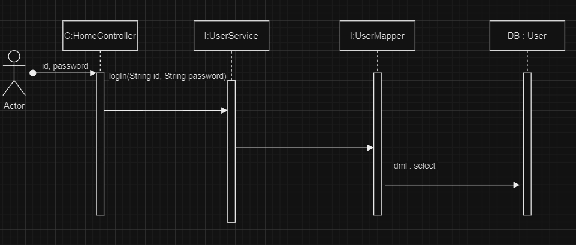

# Getting Started

### 로그인 구현 프로젝트
### 1. spec and dependency
* springboot 2.7.13
* java 17
* spring-boot-starter-data-jdbc
* spring-boot-starter-web
* spring-boot-starter-thymeleaf
* mybatis-spring-boot-starter:2.3.1

### 2. DB
```sql
spring.datasource.url=jdbc:mysql://localhost:3306
spring.datasource.driver-class-name=com.mysql.cj.jdbc.Driver
spring.datasource.username=root
spring.datasource.password=2841
```

### 3. DDL
```sql
CREATE TABLE `USER` (
    `id` INT NOT NULL  AUTO_INCREMENT PRIMARY KEY,
    `userId` VARCHAR(20) NOT NULL,
    `userPassword` INT not null
)
    
COMMENT='회원정보'
COLLATE='utf8mb3_general_ci';
```

### 3. sequence diagram



